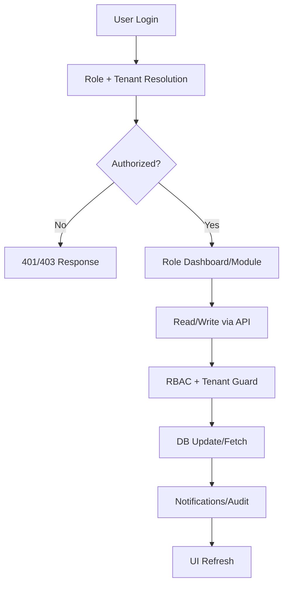
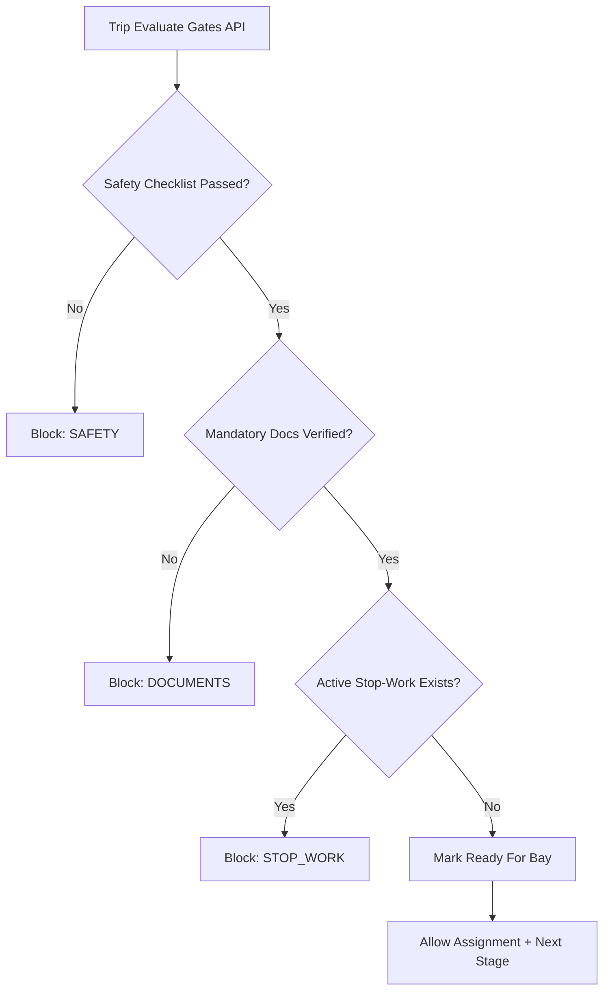

# EIPL Terminal Ops: Features, Roles, and Flowcharts

Last updated: 2026-02-23

## 1. Application Summary

EIPL Terminal Ops is a multi-role terminal operations platform for LPG/POL/Chemical movements. It covers:

- Booking and scheduling
- Trip and gate lifecycle
- Yard and bay/arm assignment
- Safety, incidents, and stop-work control
- Document compliance and verification
- Reports, audit, and notifications
- Real-time operations and forecasting
- Collaboration (communications/tasks)
- EIPL Assist (live AI + operational fallback)

Primary code references:

- `src/app` (UI pages + API routes)
- `src/lib/rbac.ts` (legacy permission map + role nav)
- `src/lib/auth/permissions.ts` (canonical permission constants)
- `prisma/schema.prisma` (role enums + core lifecycle enums)

## 2. Role Catalog

Roles from `prisma/schema.prisma`:

- `SUPER_ADMIN`
- `TERMINAL_ADMIN`
- `CLIENT`
- `TRANSPORTER`
- `SECURITY`
- `SURVEYOR`
- `HSE_OFFICER`
- `AUDITOR`
- `TRAFFIC_CONTROLLER`

Default home routes from `src/lib/rbac.ts`:

- `SUPER_ADMIN` -> `/dashboard`
- `TERMINAL_ADMIN` -> `/dashboard`
- `CLIENT` -> `/dashboard`
- `TRANSPORTER` -> `/transporter/trips`
- `SECURITY` -> `/security/gate`
- `SURVEYOR` -> `/dashboard`
- `HSE_OFFICER` -> `/hse`
- `AUDITOR` -> `/audit-logs`
- `TRAFFIC_CONTROLLER` -> `/controller/console`

## 3. Feature Inventory (Module-wise)

## 3.1 Core Operations and Planning

- Dashboard: `/dashboard`
- Bookings: `/bookings`, `/bookings/new`, `/bookings/[id]`
- Schedule: `/schedule`
- Transporter trips: `/transporter/trips`, `/transporter/trips/[id]/qr`
- Controller Console: `/controller/console`
- Yard Console: `/controller/yard-console`
- Live Ops: `/live-ops`
- Forecast: `/forecast`

Key APIs:

- `/api/bookings`, `/api/bookings/[id]`, `/api/bookings/stats`
- `/api/bookings/[id]/schedule`
- `/api/bookings/[id]/assign-arm`
- `/api/truck-trips`, `/api/truck-trips/[id]/qr`
- `/api/controller/state`
- `/api/controller/apply-assignment`
- `/api/controller/bay-action`
- `/api/controller/reclassify`
- `/api/controller/update-eta`
- `/api/loading-arms`
- `/api/live/movements`
- `/api/forecast`

## 3.2 Gate and Security

- Gate operations page: `/security/gate`

Key APIs:

- `/api/gate/scan`
- `/api/gate/check-in`
- `/api/gate/check-out`
- `/api/gate/today`
- `/api/gate-pass/process`

## 3.3 Safety and HSE

- HSE dashboard: `/hse`
- Incident pages: `/hse/incidents`, `/hse/incidents/new`, `/hse/incidents/[id]`
- Incident report shortcuts: `/hse/incidents/report`, `/incidents/report`
- Protocol page: `/hse/protocols/gas-leak`

Key APIs:

- `/api/safety/checklists`
- `/api/safety/stop-work`
- `/api/safety/stop-work/[id]/resolve`
- `/api/incidents`
- `/api/incidents/[id]`
- `/api/incidents/[id]/close`

## 3.4 Documents and Compliance

- Client document upload: `/client/documents`
- Admin/surveyor review: `/admin/documents-review`

Key APIs:

- `/api/documents`
- `/api/documents/upload`
- `/api/documents/[id]/verify`
- `/api/documents/[id]/reject`
- `/api/trips/[id]/evaluate-gates`
- `/api/trips/[id]/transition-stage`
- `/api/trips/[id]/generate-evidence-pack`

## 3.5 Reports, Audit, and Intelligence

- Reports: `/reports`
- Audit logs: `/audit-logs`

Key APIs:

- `/api/reports/bookings`
- `/api/reports/movements`
- `/api/reports/safety`
- `/api/reports/bay-utilization`
- `/api/audit-logs`
- `/api/intelligence/executive-briefing`
- `/api/inventory/summary`

## 3.6 Communications and Tasks

- Communications workspace: `/communications`

Key APIs:

- `/api/comms/conversations`
- `/api/comms/conversations/[id]`
- `/api/comms/conversations/[id]/messages`
- `/api/comms/conversations/[id]/members`
- `/api/comms/conversations/[id]/read`
- `/api/comms/conversations/[id]/stream`
- `/api/comms/conversations/unread-counts`
- `/api/comms/mentions/search`
- `/api/comms/context-search`
- `/api/comms/tasks`
- `/api/comms/tasks/[id]`

## 3.7 Assist and AI

- Embedded assistant widget (global)
- Communications drawer assistant

Key APIs:

- `/api/chat` (structured EIPL Assist response, live/fallback mode)
- `/api/chat/ops`
- `/api/health/assist`
- `/api/ai/upload`
- `/api/ai/plan`
- `/api/ai/ocr`

## 3.8 Platform and Admin Support

- Login: `/login`
- Notifications: `/notifications`
- Settings: `/settings`
- Forms: `/forms`, `/forms/[formType]`
- Support contacts: `/contacts/control-room`, `/support/contact`

Key APIs:

- `/api/auth/[...nextauth]`
- `/api/notifications`
- `/api/forms/extract`
- `/api/forms/submit`
- `/api/dashboard/stats`
- `/api/lookup/*` (`bays`, `clients`, `products`, `terminals`, `timeslots`, `transporters`)
- `/api/v1/tenants/me`
- `/api/v1/appointments`
- `/api/v1/webhooks`
- `/api/health`
- `/api/cron/digest`

## 4. Role-to-Feature Matrix (Operational View)

Legend:

- `Full` = end-to-end operate/manage
- `View` = read/list only
- `Limited` = role-scoped subset
- `No` = not intended path

| Role | Bookings | Trips | Gate Ops | Yard/Controller | HSE | Documents | Reports | Audit | Forecast/Live Ops | Comms | Assist |
|---|---|---|---|---|---|---|---|---|---|---|---|
| `SUPER_ADMIN` | Full | Full | Full | Full | Full | Full | Full | Full | Full | Full | Full |
| `TERMINAL_ADMIN` | Full | Full | View/Manage | Full | Full | Full | Full | Limited | Full | Full | Full |
| `TRAFFIC_CONTROLLER` | View | View | View | Full | Limited | View | Limited | No | Full | Full | Full |
| `HSE_OFFICER` | View | View | Limited | Limited | Full | View | Full | Limited | Limited | Full | Full |
| `SECURITY` | View | View | Full | Limited | Incident create/read limited | Limited | No | No | Live Ops allowed | Full | Full |
| `SURVEYOR` | View | View | View | No | View | Verify/Reject | Full | No | Limited | Full | Full |
| `AUDITOR` | View | View | View | No | View | View | Full | Full | Forecast allowed | Read-heavy | Full |
| `CLIENT` | Create/Update own | No direct ops | No | No | No | Upload/View own | No | No | No | Full | Full |
| `TRANSPORTER` | View | Full (own) | No | No | No | Upload (role-scoped) | No | No | No | Read/limited write | Full |

Source of truth:

- `src/lib/rbac.ts`
- `src/lib/search-routes.ts`
- Per-route guards in `src/app/api/**/route.ts`

## 5. End-to-End Flowcharts

## 5.1 High-Level User/System Flow



## 5.2 Booking-to-Exit Operational Lifecycle


## 5.3 Compliance Gate Decision Flow



## 5.4 Document Workflow (Client to Verification)

```mermaid
flowchart TD
  A[Client/Transporter Upload Doc] --> B[/api/documents/upload]
  B --> C[Document Status: PENDING]
  C --> D[Terminal Admin/Surveyor Review]
  D -->|Verify| E[Status: VERIFIED]
  D -->|Reject| F[Status: REJECTED + Reason]
  E --> G[Compliance Gate Re-evaluation]
  F --> H[Client Re-upload]
  H --> C
```

## 5.5 EIPL Assist Runtime Flow (Live + Fallback)

```mermaid
flowchart TD
  A[User Message] --> B[/api/chat]
  B --> C[Auth + Role + Intent + Snapshot]
  C --> D{OpenAI Structured Response OK?}
  D -- Yes --> E[Live Response]
  D -- No --> F[Operational Fallback Builder]
  F --> G[Role-Aware Actions + Metrics]
  E --> H[Persist ChatLog]
  G --> H
  H --> I[UI Card: Live/Fallback Badge]
```

## 6. Notes on Access Control and Data Safety

- All APIs are server-side guarded (not only UI hidden links).
- Role restrictions are applied both at route level and data scope level.
- `CLIENT` and `TRANSPORTER` get scoped views for booking/trip/document access.
- `x-tenant` + middleware subdomain/header strategy isolates tenant context.
- Audit and notification events are generated across key operational actions.

## 7. Recommended Operating Documentation Pack

If you want a complete handover set, keep these 4 docs together:

1. This file: `docs/app-features-flow-roles.md`
2. Runbook: deployment, env, incident recovery
3. API contract: endpoint request/response examples by module
4. SOP mapping: business SOP -> app action mapping (HSE, gate, compliance)

